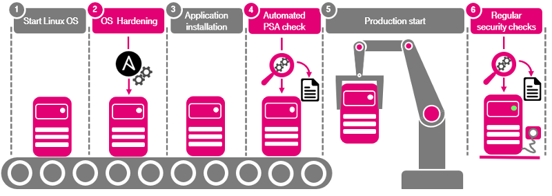

<!---
tel-it-security-automation :- Ansible roles for automated security hardening.  
Copyright (c) 2020 Maximilian Hertstein [...] Deutsche Telekom AG 
contact: devsecops@telekom.de 
This file is distributed under the conditions of the Apache-2.0 license. 
For details see the files LICENSING, LICENSE, and/or COPYING on the toplevel.
--->

# Security & Compliance Automation

Author: DevSecOps Team

Company: [Deutsche Telekom IT GmbH](https://www.telekom.com)

E-Mail: [devsecops@telekom.de](mailto:devsecops@telekom.de)

-------------------------------------------------------------------------------

## Introduction

Software is delivered by vendors with a minimal pre-configuration that is feasible for most customers. This is also true for security relevant configuration which leads to insecure systems in default configuration. To change this an important job in IT security is the secure configuration of operating systems and applications - also named hardening. This is a complex and error-prone task if done manually. Additionally, this task must be repeated and controlled in case of any changes on a system.

The DevSecOps team of Deutsche Telekom IT GmbH has the mission to deliver tools and solutions that help their customers to build secure application and services. The intention of DevSecOps teams project "Security & Compliance Automation" is the implementation of a solution for automated hardening and compliance checks that allow fast, reproducible and reliable implementation and documentation of security requirements for operating systems and applications.

## Solution

This project provides an automated solution to implement security hardening for operating systems and applications. This is needed to reach an adequate security level and to be compliant to the security requirements from Telekom Security. The solution helps to prepare systems that can easily pass the technical part of the Privacy & Assessment Process (PSA) of Telekom Security and Group Privacy.

The scripts are developed in a way, that they can be used to automatically harden operating systems and applications. Additionally the roles can be used to perform compliance checks in Ansible check mode ("dry run").

## Ansible Roles

Two roles are currently available:

- Ansible role for hardening of Linux based Servers
- Ansible role for hardening of OpenSSH daemon on Linux

The hardening will be done following the security requirements for

- Linux servers (3.65) 
- SSH (3.04)

from Telekom Security (see [References](#references) for used document versions).

## Test Scripts

The folder `/testing` includes shell scripts for testing for all security requirements for SSH and Linux. The scripts generate a logfile and a Statement of Compliance list, that can be used for needed documentation of compliance level for Telekom Security Privacy & Security Assessment.

## Supported Platforms

### Ansible control node requirements

- Ansible version: 2.9 (or higher)
- Python version: 3.5 (or higher)

### Managed node requirements

On managed node the following Python version must be installed:

- Python version: 3.5 (or higher)

The roles are tested for hardening of the following Linux versions:

- Ubuntu 16.04 LTS
- Ubuntu 18.04 LTS
- Ubuntu 20.04 LTS
- RedHat Enterprise Linux 7
- RedHat Enterprise Linux 8
- CentOS 7
- CentOS 8
- Amazon Linux 2
- Suse Linux Enterprise Server 12
- Suse Linux Enterprise Server 15

> **IMPORTANT:** These roles only supports Linux versions for SERVERS! The role is not tested with desktop systems and can cause unexpected malfunctions.

## Changelog

### v1.0 (29.01.2020) - First Release

### v1.1 (08.05.2020) - Bugfix

- **Ansible (Linux)**: Fixed issue with packages uninstallation on RedHat 8 [(issues 69251)](https://github.com/ansible/ansible/issues/69251) by adding autoremove option in Ansible
- **Ansible (Linux)**: Added dependent packages in the testing script to ensure, that dependent packages will be deleted as well.

### v.1.2 (28.05.2020) - New Features

- **Test Script**: Changed to a modular structure. Start script (start_testing.sh) available to execute several test case files.
- **Ansible (general)**: Config changes to support for CentOS 8 and Ubuntu 20.04 added and tested.
- **Ansible (general)**: Moved variables from specific files (e.g. `vars(01)basic-hardening.ym` to `/vars/main.yml`.
- **Ansible (general)**: Added default values to variables and optional use of customer defined variable file.
- **Ansible (Linux)**: Added missing requirement (Req-18) to enable GPGCheck for enabled repositories.
- **Ansible (Linux)**: Added missing requirement (Req-28) to enable auditing in bootlader configuration.
- **Ansible (Linux)**: Change for IPTables requirements (Req-46 to 49) for IPv6 support.
- **Ansible (SSH)**: Added new requirement (Req-6) to configure host key algorithms.

## References

Telekom Security - Security Requirements:

- SecReq 3.65: Linux OS for Servers (version 1.4; 01.07.2020)
- SecReq 3.04: SSH (version 2.7, 01.07.2020)

The document can be found on [Telekom Security PSA Portal](https://psa-portal.telekom.de) (only internal).

A public available complete set of all security requirements of Deutsche Telekom AG can be downloaded here: [Telekom Security - Requirements](https://www.telekom.com/resource/blob/327540/0af4a73d01334926f71d5530a2c2477e/dl-security-requirements-data.zip) (ZIP file)

## License

Apache License, Version 2.0

See file [LICENSE](./LICENSE)